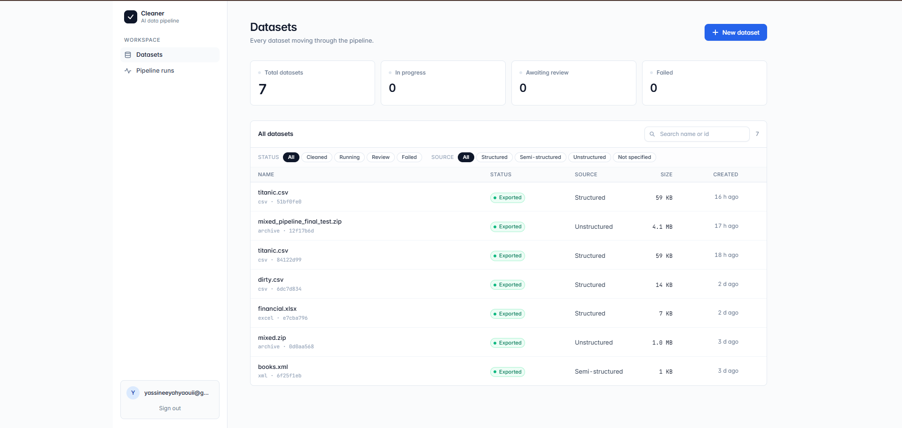
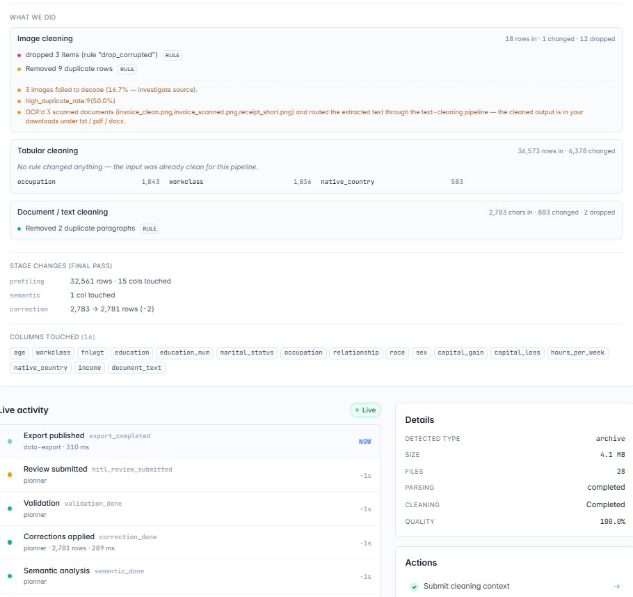

<h1 align="center">Yassine Yahyaoui — AI/ML Engineer</h1>

  Building LLM systems, multi-agent pipelines, and generative AI models that ship to production. 
  <b>Top Rated on Upwork</b> · Tunisia 🇹🇳 · Open to remote freelance

  <a href="mailto:yassineeyahyaouii@gmail.com">📧 Email</a> ·
  <a href="https://www.upwork.com">💼 Upwork</a> ·
  <a href="https://www.linkedin.com/in/yass1ne">🔗 LinkedIn</a>

---

## What I build

| Domain | Stack |
|---|---|
| 🤖 Agentic AI & Multi-Agent Systems | LangChain · LangGraph · Groq · Tool-use agents |
| 🧠 LLM Pipelines & RAG | FAISS · Neo4j · Llama 3.3 · Fine-tuning |
| 🎵 Generative AI — Audio & Image | Diffusion Models · PyTorch · LDM · AudioLDM |
| 📊 Data Engineering at Scale | PySpark · Kafka · Delta Lake · AWS SageMaker |
| ⚡ Real-time Streaming Platforms | Kafka · Spark Streaming · Airflow · Grafana |

---

## 🌟 Flagship — [AI-Powered Data Cleaner](https://github.com/Yaass1ne/ai-data-cleaner)

> **A distributed, LLM-guided data-quality platform that ingests messy data, plans corrections with an AI advisor, executes them on a LangGraph DAG with human-in-the-loop review, and exports cleaned data plus an audit report.** &nbsp;·&nbsp; 👉 [**View the repo →**](https://github.com/Yaass1ne/ai-data-cleaner)

  
   
  <em>Datasets workspace — every dataset moving through the cleaning pipeline.</em>

  
   
  <em>Auto-generated audit report — per-pipeline changes, lineage, and live activity.</em>

A production-grade **polyrepo**: five FastAPI microservices + a React SPA, coordinated with Docker Compose and full observability.

- 🔌 **Multi-format ingestion** — CSV, Parquet, Excel, JSON, XML, PDF, images, text + cloud/DB connectors (S3, GCS, Azure, Postgres, MongoDB)
- 🧠 **LLM-guided rule planning** with a deterministic correction engine (mojibake repair, fuzzy categorical folding, sentinel nulling, date normalisation, email→name) and a hard identity-field veto
- 🔁 **Three pipelines in one dataset** — tabular, text, and image (OCR + content classification) processed together
- 👤 **Human-in-the-loop** — unified Rule Review + Post-Correction Review gates, even across mixed multi-schema datasets
- 🧾 **Event-sourced lineage** streamed to the SPA over SSE, plus a generated audit PDF
- 📈 **Observability** — OpenTelemetry tracing (Tempo), Prometheus, Grafana

`FastAPI` · `LangGraph` · `LangChain` · `React` · `TypeScript` · `PostgreSQL` · `RabbitMQ` · `MinIO/S3` · `Docker` · `OpenAI`

---

## 🚀 Projects

### 🤖 Agentic AI & LLM Systems

| Project | Description | Stack |
|---|---|---|
| 🏦 [Financial Intelligence Command Center](https://github.com/Yaass1ne/Financial-Intelligence-Command-Center) | AI platform replacing 10–15 financial tools: RAG, episodic memory, knowledge graph, Monte Carlo simulation | FastAPI · Neo4j · FAISS · Groq · React |
| 🍽️ **AI Restaurant Concierge** · 🔒 Private | Voice-first dining concierge: real-time voice agent, 3D dish visualisation, GLB→USDZ pipeline, automated reservations | Next.js · LiveKit · Python · AWS CDK |

### 📈 AI Algorithmic Trading

| Project | Description | Stack |
|---|---|---|
| 📊 [MT5 FTMO Trader](https://github.com/Yaass1ne/mt5-ftmo-trader) | Autonomous FTMO-compliant MetaTrader 5 bot: Smart Money Concepts detection + LLM veto, risk circuit breakers, multi-target exits, Telegram monitoring | Python · MetaTrader5 · OpenAI/Ollama |
| 🧠 [Vidar AI](https://github.com/Yaass1ne/vidar-ai) | LLM-powered MT5 trading system with SMC market-structure detection, strategy RAG, REST API + React dashboard | FastAPI · React · MetaTrader5 · OpenAI |

### ⚡ Data Engineering & Analytics

| Project | Description | Stack |
|---|---|---|
| ⚡ [Lakehouse Streaming Data Platform](https://github.com/Yaass1ne/Event-Driven-Pipeline-) | End-to-end Lambda Architecture: Kafka → Spark → Delta Lake → Airflow → PostgreSQL → Grafana | Kafka · Spark · Delta Lake · Docker |
| 📊 [CDC BRFSS 2022 Health Analytics](https://github.com/Yaass1ne/Data-Analytics-CDC-BRFSS-2022) | EDA + ML models on the CDC BRFSS 2022 survey (450k+ responses) with dashboards | Jupyter · pandas · Power BI · scikit-learn |
| 🩺 [BRFSS Health Dashboard](https://github.com/Yaass1ne/brfss-health-dashboard) | Streamlit dashboard exploring disease ↔ lifestyle correlations in the BRFSS 2022 dataset | Streamlit · pandas · seaborn |
| 🌍 [World Happiness Dashboard](https://github.com/Yaass1ne/world-happiness-d3) | Interactive D3.js choropleth + linked charts on the World Happiness Report | D3.js · JavaScript · HTML/CSS |

### 🎵 Generative AI — Audio & Voice

| Project | Description | Stack |
|---|---|---|
| 🔊 [Memory-Augmented Latent Diffusion](https://github.com/Yaass1ne/memory-augmented-latent-diffusion) | Research framework augmenting latent-diffusion audio generation with a retrieval memory bank + conditioning modules and a custom PRISM evaluation suite | PyTorch · Diffusers · Stable Audio · T5 |
| 🤖 [AI Voice + Face Companion](https://github.com/Yaass1ne/ai-voice-face-companion) | Voice + face AI companion: Whisper STT, Silero VAD, Groq LLM, ElevenLabs TTS, 25+ emotion pixel-art face renderer | Python · pygame · Whisper · ElevenLabs |

### 🧑‍💼 NLP & Web Applications

| Project | Description | Stack |
|---|---|---|
| 🧑‍💼 [AI Recruitment Filtering System](https://github.com/Yaass1ne/RH-recrutement-app) | Automated candidate screening with semantic NLP + GPT-3.5 interview scoring | Flask · spaCy · SBERT · GPT-3.5 |
| 📄 [NLP Recruitment System](https://github.com/Yaass1ne/nlp-recruitment-system) | CV-to-job semantic matching (SBERT + spaCy) with a GPT-3.5 interview chatbot and auto-scoring | Flask · spaCy · SBERT · OpenAI |
| 🚗 [LuxAutoMart](https://github.com/Yaass1ne/luxautomart) | Symfony luxury-car marketplace: listings, user management, admin back-office | Symfony 5.4 · Doctrine · Twig · MySQL |

### 🔬 Research

| Project | Description | Stack |
|---|---|---|
| 🧪 [Federated Face Recognition](https://github.com/Yaass1ne/federated-face-recognition) | Federated-learning research for face recognition across distributed datasets without centralising raw images | PyTorch · Federated Learning · Jupyter |

---

## 🛠️ Tech Stack

---

## 📊 GitHub Stats

  
  

---

📫 **Available for freelance projects** — reach me at yassineeyahyaouii@gmail.com
